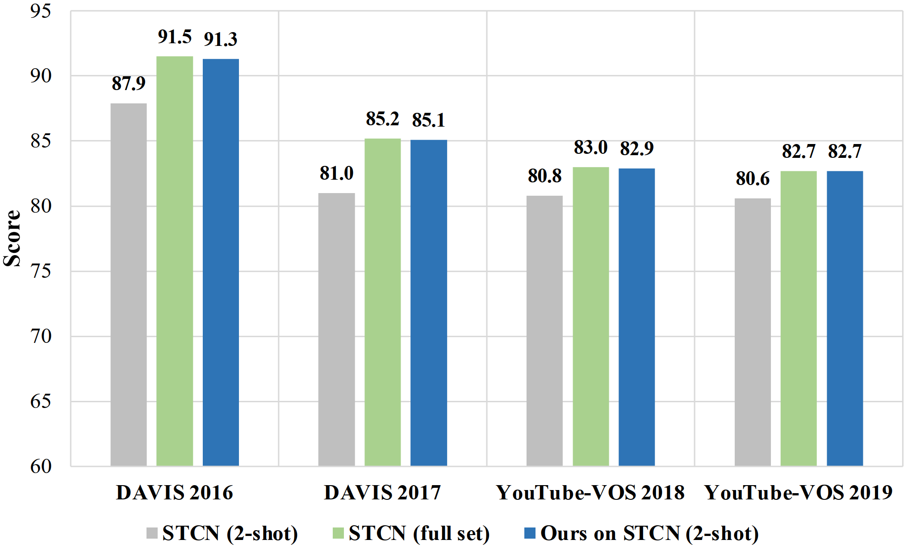
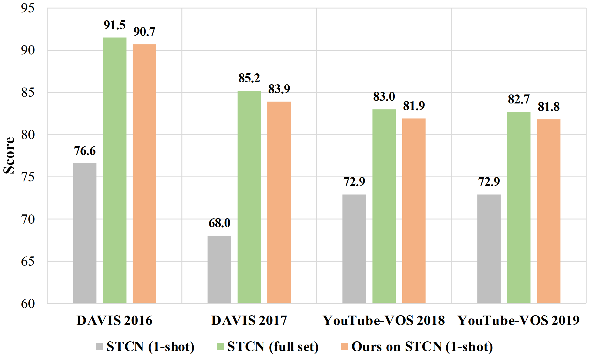
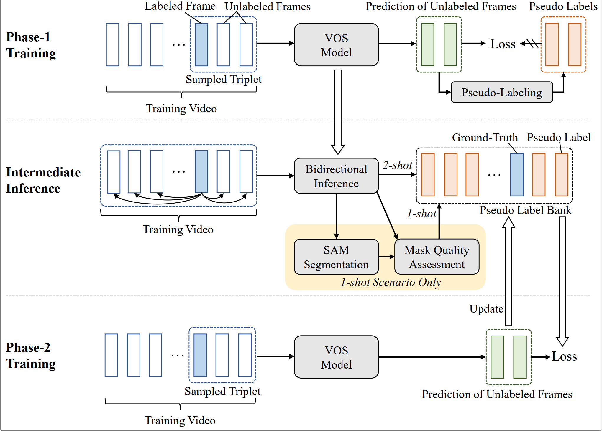

# Low-shot VOS
For the first time, we demonstrate the feasibility of low-shot video object segmentation: one or two labeled frames per video are almost sufficient for training a decent VOS model. 

In this work, we present a simple yet efficient training paradigm to exploit the wealth of information present in unlabeled frames, with only a small amount of labeled data (e.g. 7.3% for YouTube-VOS and 2.9% for DAVIS, under the two-shot setting; 3.7% for YouTube-VOS and 1.4% for DAVIS, under the one-shot scenario), our approach still achieves competitive results in contrast to the counterparts trained on full set (2-shot STCN equipped with our approach achieves 85.1%/82.7% on DAVIS 2017/YouTube-VOS 2019, which is -0.1%/-0.0% lower than the STCN trained on full set). 

## Installation

This work follows [STCN](https://github.com/hkchengrex/STCN), please install the running environment and prepare datasets according to the corresponding instructions. Besides, we recommend the version of PyTorch >=1.8.

## Phase-1, intermediate inference and Phase-2
Please refer to [2-shot VOS](https://github.com/yk-pku/Two-shot-Video-Object-Segmentation) for details.

## For fine-tuning SAM
1. Fine-tuning SAM: refer to sam_finetune.py;
1. Using fine-tuned SAM to predict masks: refer to sam_finetune_infer.py.

## For using mask quality assessment
1. Refer to sam_rank.py to train the rank net;
2. Refer to sam_rank_infer.py to select the best prediction.